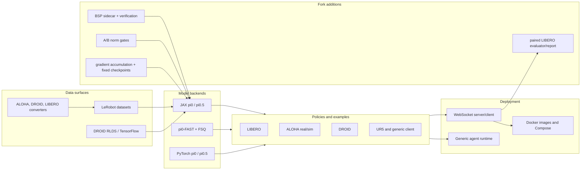
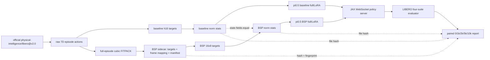
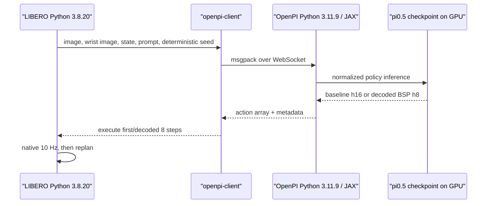

# π0.5 + LIBERO BSP 仓库架构与瘦身审计

本文说明专项 fork 在 tag `phase1-pre-slim-1b976fc` 前后的工程结构、保留边界与能力代价。
它是代码审计文档，不是服务器状态声称；服务器操作以
[第一阶段 runbook](pi05_libero_bsp_phase1_server.md) 为准。

## 1. 目标闭包

瘦身后的仓库只服务一个闭环：

```text
LIBERO v2.0
  -> baseline / BSP sidecar
  -> isolated norm stats
  -> pi0.5 JAX full or LoRA
  -> WebSocket inference
  -> LIBERO four-suite evaluation
  -> paired baseline/BSP report
```

“删除后无影响”在本文中的严格含义是：删除项不参与上述闭环。它不表示上游功能等价，
也不表示以后迁移到别的机器人、数据格式、模型后端或部署平台时没有恢复成本。

## 2. 清理前工程

### 2.1 清理前 tracked tree

下树对应 `phase1-pre-slim-1b976fc`，以目录和文件组完整列出 182 个 tracked entry；
两个 `third_party` 项是 gitlink。

```text
openpi05-bsp/
├── .dockerignore
├── .github/
│   ├── CODEOWNERS
│   └── workflows/{pre-commit.yml,test.yml}
├── .gitignore
├── .gitmodules
├── .pre-commit-config.yaml
├── .python-version
├── .superpowers/sdd/pi05-libero-bsp-sdd-plan/
│   └── {task-1-report.md,task-2-report.md,task-3-report.md,task-4-report.md,task-5b-report.md}
├── .vscode/settings.json
├── {CONTRIBUTING.md,LICENSE,LICENSE_GEMMA.txt,README.md}
├── docs/
│   ├── {docker.md,norm_stats.md,pi05_libero_bsp_phase1_server.md}
│   ├── {pi05_libero_bsp_server_state.md,remote_inference.md}
│   └── superpowers/
│       ├── plans/
│       │   ├── 2026-08-09-phase1-short10k-execution-status.md
│       │   ├── 2026-08-09-phase1-short10k-protocol.md
│       │   └── 2026-08-09-phase1-zero-five-k-evaluation.md
│       └── specs/
│           ├── 2026-08-09-phase1-short10k-protocol-design.md
│           └── 2026-08-09-phase1-zero-five-k-evaluation-design.md
├── examples/
│   ├── aloha_real/
│   │   ├── {Dockerfile,README.md,compose.yml,constants.py}
│   │   ├── {convert_aloha_data_to_lerobot.py,env.py,main.py,real_env.py}
│   │   └── {requirements.in,requirements.txt,robot_utils.py,video_display.py}
│   ├── aloha_sim/
│   │   ├── {Dockerfile,README.md,compose.yml,env.py,main.py}
│   │   └── {requirements.in,requirements.txt,saver.py}
│   ├── droid/
│   │   ├── {README.md,README_train.md,compute_droid_nonidle_ranges.py}
│   │   └── {convert_droid_data_to_lerobot.py,main.py}
│   ├── libero/
│   │   ├── {Dockerfile,README.md,compose.yml,convert_libero_data_to_lerobot.py}
│   │   └── {main.py,requirements.in,requirements.txt}
│   ├── simple_client/
│   │   ├── {Dockerfile,README.md,compose.yml,main.py}
│   │   └── {requirements.in,requirements.txt}
│   ├── ur5/README.md
│   └── {convert_jax_model_to_pytorch.py,inference.ipynb,policy_records.ipynb}
├── packages/openpi-client/
│   ├── pyproject.toml
│   └── src/openpi_client/
│       ├── {__init__.py,action_chunk_broker.py,base_policy.py,image_tools.py}
│       ├── {image_tools_test.py,inference.py,inference_test.py}
│       ├── {libero_eval.py,libero_eval_test.py,libero_report.py,libero_report_test.py}
│       ├── {msgpack_numpy.py,msgpack_numpy_test.py}
│       ├── runtime/
│       │   ├── {agent.py,environment.py,runtime.py,subscriber.py}
│       │   └── agents/policy_agent.py
│       └── {websocket_client_policy.py,websocket_client_policy_test.py}
├── pyproject.toml
├── scripts/
│   ├── {__init__.py,compare_libero_phase1.py,compare_libero_phase1_test.py}
│   ├── {compute_norm_stats.py,compute_norm_stats_test.py}
│   ├── docker/
│   │   └── {compose.yml,install_docker_ubuntu22.sh,
│   │        install_nvidia_container_toolkit.sh,serve_policy.Dockerfile}
│   ├── {libero_compose_preflight.py,libero_compose_preflight_test.py}
│   ├── {libero_eval_test.py,libero_revision_contract_test.py}
│   ├── {pi05_libero_bsp_phase1_server_test.py,prepare_libero_bsp.py}
│   ├── {prepare_libero_bsp_test.py,serve_policy.py,server_runtime_contract_test.py}
│   └── {train.py,train_pytorch.py,train_test.py}
├── src/openpi/
│   ├── {__init__.py,conftest.py,py.typed,transforms.py,transforms_test.py}
│   ├── models/
│   │   ├── {__init__.py,gemma.py,gemma_fast.py,lora.py,lora_test.py}
│   │   ├── {model.py,model_test.py,pi0.py,pi0_config.py,pi0_fast.py,pi0_test.py}
│   │   ├── {siglip.py,tokenizer.py,tokenizer_test.py,vit.py}
│   │   └── utils/fsq_tokenizer.py
│   ├── models_pytorch/
│   │   ├── {gemma_pytorch.py,pi0_pytorch.py,preprocessing_pytorch.py}
│   │   └── transformers_replace/models/
│   │       ├── gemma/{configuration_gemma.py,modeling_gemma.py}
│   │       ├── paligemma/modeling_paligemma.py
│   │       └── siglip/{check.py,modeling_siglip.py}
│   ├── policies/
│   │   ├── {aloha_policy.py,droid_policy.py,libero_policy.py,libero_policy_test.py}
│   │   └── {policy.py,policy_config.py,policy_seed_test.py,policy_test.py}
│   ├── serving/websocket_policy_server.py
│   ├── shared/
│   │   ├── {__init__.py,array_typing.py,download.py,download_test.py}
│   │   └── {image_tools.py,image_tools_test.py,nnx_utils.py,normalize.py,normalize_test.py}
│   └── training/
│       ├── {bsp.py,bsp_dataset.py,bsp_dataset_test.py,bsp_test.py,checkpoints.py}
│       ├── {config.py,data_loader.py,data_loader_test.py,droid_rlds_dataset.py}
│       ├── misc/{polaris_config.py,roboarena_config.py}
│       └── {optimizer.py,runtime_paths.py,runtime_paths_test.py,sharding.py,
│            train_planning.py,train_planning_test.py,utils.py,weight_loaders.py}
├── third_party/{aloha,libero}
└── uv.lock
```

### 2.2 清理前架构



清理前仍同时表达“通用 OpenPI 上游发行版”和“专项 BSP 复现”两个目标，导致配置、依赖、
示例和部署入口的阅读面远大于实际实验闭包。

### 2.3 上游与 BSP fork 的边界

| 来源 | 主要保留内容 | 本 fork 的改动 |
|---|---|---|
| Physical Intelligence OpenPI | π0.5 JAX 模型、Gemma/SigLIP、PaliGemma tokenizer、Flax/Optax/Orbax 训练、LeRobot loader、policy/WebSocket 骨架、官方 `pi05_libero` 配置 | 将生产注册表收敛到 LIBERO；增加固定 h16 full/LoRA A/B 配置；支持确定性请求 seed |
| B-spline Policy 论文与 MIT 代码 | FITPACK 分段拟合、knot/control 语义、误差判据 | 移植到 `bsp.py`；加入 episode sidecar、强身份、相对 knot materialization、严格验证和 h8 解码 |
| 本复现实验层 | 无上游对应物 | 梯度累积、step 0 与 0/1k/2k/5k/10k 保留、A/B norm gate、四套件审计 evaluator、paired bootstrap report、服务器安全路径 |

BSP 作者仓库和论文 PDF 是实现参考，不是服务器运行依赖，也不复制进本 fork。

## 3. 删除审计

下表按功能组覆盖从 `phase1-pre-slim-1b976fc` 到本分支 HEAD 的全部 `D` 项。隐藏的
`deletion-pattern` 标记由 `scripts/repository_documentation_contract_test.py` 使用
`fnmatch` 与 `git diff --name-status phase1-pre-slim-1b976fc...HEAD` 自动对账。

| 原路径 | 原始用途 | 删除原因 | 当前替代 | 损失能力 | 对目标闭环无影响的依据 |
|---|---|---|---|---|---|
| `.dockerignore`；`scripts/docker/**`；`examples/libero/Dockerfile`；`examples/libero/compose.yml`；`scripts/libero_compose_preflight.py`；`scripts/libero_compose_preflight_test.py` | 构建 policy/simulator 镜像、安装宿主组件、编排端口/挂载/GPU/EGL，并做容器前检 | 阿里云 DSW 托管环境没有可用 daemon/Compose/toolkit；实际验证路线是双 Python + WebSocket + 私有 EGL vendor JSON | [host-only runbook](pi05_libero_bsp_phase1_server.md) 与 `scripts/libero_host_contract_test.py` | 不再提供一键镜像构建、嵌套容器编排和容器 GPU 前检 | 训练仍由 Python 3.11/JAX 执行，LIBERO 仍由 Python 3.8 执行，通信协议未变 |
| `examples/aloha_real/**`；`examples/aloha_sim/**`；`third_party/aloha` | ALOHA 实机/仿真、数据转换、视频、依赖与 gitlink | 本实验只有 LIBERO | 锁定 `third_party/libero` 和 `examples/libero/main.py` | 不再支持 ALOHA 采集、转换、训练、推理或仿真 | 五个配置、数据 transforms 和 evaluator 均不引用 ALOHA |
| `examples/droid/**`；`examples/ur5/**` | DROID 数据处理/机器人客户端及 UR5 使用说明 | 非 LIBERO 平台 | LIBERO evaluator | 不再提供 DROID/UR5 操作路径 | 生产配置和 policy 注册表只接受 LIBERO |
| `examples/simple_client/**` | 无机器人随机输入客户端和独立镜像示例 | 通用示例会误导为受支持入口 | `openpi-client` + LIBERO evaluator | 不再提供随机 observation 的通用客户端演示 | 目标 observation schema 由真实 LIBERO evaluator 构造 |
| `examples/inference.ipynb`；`examples/policy_records.ipynb` | 交互式通用推理和记录示例 | 不参与可审计 CLI 流程 | `serve_policy.py`、evaluator、JSONL/manifest | 不再维护 notebook 教程 | 正式实验全部由可记录的 CLI 和产物完成 |
| `examples/convert_jax_model_to_pytorch.py`；`examples/libero/convert_libero_data_to_lerobot.py` | JAX→PyTorch 权重转换与原始 RLDS→LeRobot 转换 | 本实验只用 JAX 和官方已转换数据 | 官方 `physical-intelligence/libero@v2.0` | 不再转换 PyTorch checkpoint 或原始 LIBERO 数据 | runbook 明确下载官方 LeRobot snapshot，不接触转换源 |
| `packages/openpi-client/src/openpi_client/action_chunk_broker.py`；`packages/openpi-client/src/openpi_client/runtime/**` | 通用 action chunk 队列、agent/environment/subscriber runtime | LIBERO evaluator 直接请求 WebSocket 并自行管理 episode | `websocket_client_policy.py`、`libero_eval.py` | 不再提供通用机器人 runtime API | LIBERO 客户端所需的序列化、图像、seed、WebSocket 与报告模块均保留 |
| `scripts/train_pytorch.py`；`src/openpi/models_pytorch/**` | PyTorch 模型、Transformers patch、训练与 checkpoint 路线 | 目标协议以 OpenPI JAX 为准，双后端增加歧义和依赖 | `scripts/train.py` + `src/openpi/models/` | 不再训练、转换或服务 PyTorch 模型 | 五个配置均实例化 JAX `Pi0Config`；正式 checkpoint 是 Orbax |
| `src/openpi/models/gemma_fast.py`；`src/openpi/models/pi0_fast.py`；`src/openpi/models/utils/fsq_tokenizer.py` | FAST 自回归动作 tokenizer 和模型 | 第一阶段只使用 π0.5 flow-matching head | `pi0.py` + PaliGemma tokenizer | 不再支持 π0-FAST/FSQ | 五个配置都使用 π0.5 flow matching；BSP target 直接进入连续 action loss |
| `src/openpi/policies/aloha_policy.py`；`src/openpi/policies/droid_policy.py` | 非 LIBERO observation/action transforms | 非目标平台 | `libero_policy.py` | 不再接受 ALOHA/DROID schema | server 环境枚举和训练配置只保留 LIBERO |
| `src/openpi/training/droid_rlds_dataset.py`；`src/openpi/training/misc/polaris_config.py`；`src/openpi/training/misc/roboarena_config.py` | RLDS loader 与非目标内部/竞技场配置 | 官方 LIBERO LeRobot 已覆盖唯一数据面 | `data_loader.py` + `LeRobotLiberoDataConfig` | 不再读取 RLDS 或生成这些配置 | sidecar fingerprint 绑定官方 LeRobot schema、episode 边界和 revision |
| `src/openpi/models/vit.py` | 未被目标路径引用的旧视觉模块 | 当前 SigLIP 路径不依赖它 | `siglip.py` | 不再保留孤立 ViT API | import 合同与目标模型测试证明生产闭包没有引用 |
| `scripts/server_runtime_contract_test.py`；`scripts/pi05_libero_bsp_phase1_server_test.py` | 旧通用 server/大 runbook 文本合同 | 被精简入口和结构化合同替代 | `core_runtime_slim_test.py`、`libero_host_contract_test.py`、本文档合同 | 不再维护旧路径的文本快照 | 新合同直接检查五配置、host 数据流、文档链接与删除对账 |
| `docs/docker.md`；`docs/pi05_libero_bsp_server_state.md`；`docs/superpowers/**` | 旧容器说明、一次性服务器快照、设计/执行过程记录 | 它们与最终 host-only 协议重复或冲突 | 当前 runbook、本文与 Git 历史/tags | 不再把中间决策日志当用户文档 | 最终协议、身份和恢复命令已集中到两份规范文档 |
| `.superpowers/sdd/pi05-libero-bsp-sdd-plan/**` | 已提交的开发 agent task 报告 | 属于过程产物，降低仓库可读性 | Git commits、tags、CI 与 architecture audit | 不再在发布树保留内部开发记录 | 不含运行时输入；删除不会改变包、CLI 或实验 artifact |

以下 marker 是上述表格的机器可读镜像；它们不增加新的删除范围：

<!-- deletion-pattern: .dockerignore -->
<!-- deletion-pattern: scripts/docker/** -->
<!-- deletion-pattern: examples/libero/Dockerfile -->
<!-- deletion-pattern: examples/libero/compose.yml -->
<!-- deletion-pattern: scripts/libero_compose_preflight.py -->
<!-- deletion-pattern: scripts/libero_compose_preflight_test.py -->
<!-- deletion-pattern: examples/aloha_real/** -->
<!-- deletion-pattern: examples/aloha_sim/** -->
<!-- deletion-pattern: third_party/aloha -->
<!-- deletion-pattern: examples/droid/** -->
<!-- deletion-pattern: examples/ur5/** -->
<!-- deletion-pattern: examples/simple_client/** -->
<!-- deletion-pattern: examples/inference.ipynb -->
<!-- deletion-pattern: examples/policy_records.ipynb -->
<!-- deletion-pattern: examples/convert_jax_model_to_pytorch.py -->
<!-- deletion-pattern: examples/libero/convert_libero_data_to_lerobot.py -->
<!-- deletion-pattern: packages/openpi-client/src/openpi_client/action_chunk_broker.py -->
<!-- deletion-pattern: packages/openpi-client/src/openpi_client/runtime/** -->
<!-- deletion-pattern: scripts/train_pytorch.py -->
<!-- deletion-pattern: src/openpi/models_pytorch/** -->
<!-- deletion-pattern: src/openpi/models/gemma_fast.py -->
<!-- deletion-pattern: src/openpi/models/pi0_fast.py -->
<!-- deletion-pattern: src/openpi/models/utils/fsq_tokenizer.py -->
<!-- deletion-pattern: src/openpi/policies/aloha_policy.py -->
<!-- deletion-pattern: src/openpi/policies/droid_policy.py -->
<!-- deletion-pattern: src/openpi/training/droid_rlds_dataset.py -->
<!-- deletion-pattern: src/openpi/training/misc/polaris_config.py -->
<!-- deletion-pattern: src/openpi/training/misc/roboarena_config.py -->
<!-- deletion-pattern: src/openpi/models/vit.py -->
<!-- deletion-pattern: scripts/server_runtime_contract_test.py -->
<!-- deletion-pattern: scripts/pi05_libero_bsp_phase1_server_test.py -->
<!-- deletion-pattern: docs/docker.md -->
<!-- deletion-pattern: docs/pi05_libero_bsp_server_state.md -->
<!-- deletion-pattern: docs/superpowers/** -->
<!-- deletion-pattern: .superpowers/sdd/pi05-libero-bsp-sdd-plan/** -->

### 3.1 直接依赖删除审计

文件删除无法覆盖 `pyproject.toml` 中的依赖修改，因此另行记录如下。这里的“删除”表示不再是
本项目的直接依赖或 dependency group；如果 LeRobot 等保留依赖仍需要某个包，resolver 可以
把它作为传递依赖留在 209-package `uv.lock` 中，不应为追求字面消失而手工改 lockfile。

| 删除的直接依赖/group | 原角色或类别 | 为什么在目标闭包内可安全删除 | 保留的替代 |
|---|---|---|---|
| `gym-aloha` | ALOHA 仿真环境 | ALOHA examples、policy 与 gitlink 均删除，生产配置只剩 LIBERO | 锁定 `third_party/libero` |
| `equinox`、`treescope` | JAX 模型/可视化辅助 | 目标生产与保留测试没有直接 import；核心状态使用 Flax NNX/JAX | `jax`、`flax` 和 stdlib contracts |
| `flatbuffers` | 通用二进制序列化 | 目标 WebSocket 不使用该编码 | `msgpack`/NumPy 编解码位于 `openpi-client` |
| `opencv-python` | 通用图像/视频处理 | 删除非目标机器人转换与 notebook 后无直接 import | `pillow`、`imageio`、`augmax` |
| `rich`、`polars` | 富 CLI 与 dataframe/report 工具 | 当前 CLI 使用 Tyro/logging；报告使用 stdlib CSV/JSON | `tyro`、`tqdm`、stdlib `csv/json` |
| `ml_collections` | 上游配置对象 | 五个生产配置由 dataclass + Tyro 注册，不再 import | `dataclasses`、`tyro` |
| `transformers` | PyTorch/Transformers backend 及本地 patch | `models_pytorch` 和转换/训练脚本已删除；JAX π0.5 不依赖它 | `gemma.py`、`siglip.py`、`pi0.py` |
| `chex` | 旧测试 assertion helper | 保留测试没有直接 import | pytest assertions 与 NumPy |
| `rlds` group：`dlimp`、`tensorflow-cpu`、`tensorflow-datasets` | DROID/RLDS 数据读取 | 官方 LIBERO v2.0 已是 LeRobot；RLDS loader 和 converter 删除 | `lerobot` 和 `data_loader.py` |
| root/client `dm-tree` | 通用 pytree 与 client 序列化测试 helper | 运行时无直接 import；`msgpack_numpy_test.py` 用 Python 3.8 兼容递归 helper 覆盖 dict/list/tuple/leaf | JAX tree（server）与 stdlib helper（client test） |
| dev `ipykernel`、`ipywidgets`、`matplotlib` | notebook kernel、widget、绘图 | 两个 notebook 删除；正式报告用内建 SVG writer | Ruff、pytest、pre-commit；`learning_curve.svg` 由 reporter 生成 |

同时把实际生产直接 import 的 `etils`、`optax`、`pydantic`、`tqdm`、`websockets`，以及
client 的 `typing-extensions` 显式提升为 direct dependencies，避免依赖偶然的传递安装。

## 4. 瘦身后工程

### 4.1 新 tracked tree

```text
openpi05-bsp/
├── .github/{CODEOWNERS,workflows/{pre-commit.yml,test.yml}}
├── {.gitignore,.gitmodules,.pre-commit-config.yaml,.python-version}
├── {.vscode/settings.json,CONTRIBUTING.md,LICENSE,LICENSE_GEMMA.txt,README.md}
├── docs/
│   ├── repository_architecture.md
│   ├── pi05_libero_bsp_phase1_server.md
│   ├── norm_stats.md
│   └── remote_inference.md
├── examples/libero/
│   └── {README.md,main.py,requirements.in,requirements.txt}
├── packages/openpi-client/
│   ├── pyproject.toml
│   └── src/openpi_client/
│       ├── {__init__.py,base_policy.py,image_tools.py,inference.py}
│       ├── {libero_eval.py,libero_report.py,msgpack_numpy.py,websocket_client_policy.py}
│       ├── {image_tools_test.py,inference_test.py,libero_eval_test.py}
│       ├── {libero_report_test.py,msgpack_numpy_test.py,websocket_client_policy_test.py}
│       └── package_contract_test.py
├── pyproject.toml
├── scripts/
│   ├── {__init__.py,prepare_libero_bsp.py,compute_norm_stats.py,train.py}
│   ├── {serve_policy.py,compare_libero_phase1.py}
│   ├── {prepare_libero_bsp_test.py,compute_norm_stats_test.py,train_test.py}
│   ├── {libero_eval_test.py,compare_libero_phase1_test.py}
│   └── {core_runtime_slim_test.py,libero_revision_contract_test.py,
│        libero_host_contract_test.py,repository_slim_contract_test.py,
│        repository_documentation_contract_test.py}
├── src/openpi/
│   ├── {__init__.py,conftest.py,py.typed,transforms.py,transforms_test.py}
│   ├── models/
│   │   ├── {__init__.py,gemma.py,lora.py,lora_test.py,model.py,model_test.py}
│   │   └── {pi0.py,pi0_config.py,pi0_test.py,siglip.py,tokenizer.py,tokenizer_test.py}
│   ├── policies/
│   │   └── {libero_policy.py,libero_policy_test.py,policy.py,policy_config.py,
│   │        policy_seed_test.py,policy_test.py}
│   ├── serving/websocket_policy_server.py
│   ├── shared/
│   │   └── {__init__.py,array_typing.py,download.py,download_test.py,image_tools.py,
│   │        image_tools_test.py,nnx_utils.py,normalize.py,normalize_test.py}
│   └── training/
│       └── {bsp.py,bsp_dataset.py,bsp_dataset_test.py,bsp_test.py,checkpoints.py,
│            config.py,data_loader.py,data_loader_test.py,optimizer.py,runtime_paths.py,
│            runtime_paths_test.py,sharding.py,train_planning.py,train_planning_test.py,
│            utils.py,weight_loaders.py}
├── third_party/libero
└── uv.lock
```

### 4.2 数据与执行架构



baseline 与 BSP 使用完全相同的 observation/state 流，只替换 action target。BSP sidecar 不复制
图像；`mapping` 把 273,465 个原始 frame 映射到 259,121 个唯一 spline target。训练 transform
将 8 个 BSP 通道补零到模型 action dimension 32；所有 16 行参与 quantile normalization 和
flow loss。反归一化后只取 8 个有效通道解码。

### 4.3 双 Python 与 `openpi-client`



`openpi-client` 是通信和评测包，不是模型。它保留：

- `base_policy.py`：policy 接口；
- `websocket_client_policy.py`：连接、超时和 metadata；
- `msgpack_numpy.py`：NumPy 序列化；
- `image_tools.py`：uint8 与 resize；
- `inference.py`：确定性 seed 请求字段；
- `libero_eval.py`：suite/episode、错误分类、重试、manifest 与 artifact writer；
- `libero_report.py`：十个 run 的身份验证、配对统计和固定六个报告产物。

它的独立 `pyproject.toml` 要求 Python ≥3.8，使 simulator 不必安装 JAX/Flax。policy server
和 simulator 必须分环境，不能把依赖强行合并。

### 4.4 五个配置

| 配置 | 模型 | target/服务输出 | 训练用途 |
|---|---|---|---|
| `pi05_libero` | π0.5 full | h10 baseline | 官方 checkpoint 校准；配置仍是 30k/EMA 0.999 |
| `pi05_libero_baseline_h16` | π0.5 full | h16 baseline | 保留作未来硬件复验 |
| `pi05_libero_bsp_h16` | π0.5 full | 16×8 参数→h8 | 保留作未来硬件复验 |
| `pi05_libero_baseline_lora_h16` | π0.5 LoRA | h16 baseline | 当前 short10k A |
| `pi05_libero_bsp_lora_h16` | π0.5 LoRA | 16×8 参数→h8 | 当前 short10k B |

phase-one A/B 固定 seed 42、有效 batch 256、无 EMA、10,000 optimizer steps，并永久保留
`0, 1000, 2000, 5000, 10000`。LoRA A/B 必须共用模型 adapter 规格、学习率、optimizer、
micro-batch 和 base checkpoint。full 与 LoRA 是两个训练家族，报告器禁止混用。

### 4.5 保留组件指南

| 组件 | 职责 | 入口 | 输入 | 输出 | 相邻依赖 |
|---|---|---|---|---|---|
| JAX 模型 | π0.5 flow loss/采样、Gemma/SigLIP、LoRA | `src/openpi/models/pi0.py` | observation、action/noise | loss 或 32D action chunk | JAX、Flax、tokenizer |
| BSP core | 固定拟合协议、sidecar I/O、knot repair、解码 | `src/openpi/training/bsp.py` | 7D episode actions / 16×8 parameters | cache targets / 8×7 actions | NumPy、SciPy；FITPACK 调用在 dataset 层 |
| BSP dataset | 官方 snapshot 身份、episode fit、mapping、verify | `src/openpi/training/bsp_dataset.py` | LeRobot dataset | `BspCache`、diagnostics | BSP core、LeRobot |
| 数据配置 | 五配置、asset id、baseline/BSP transforms | `src/openpi/training/config.py` | config name、路径 overrides | `TrainConfig`/`DataConfig` | model、policy、loader |
| 数据装载 | 读取官方 LeRobot；BSP 时只替换 action | `src/openpi/training/data_loader.py` | dataset root、sidecar | transformed batches | Torch DataLoader、LeRobot |
| Norm | 分别统计 state/action 并做 A/B gate | `scripts/compute_norm_stats.py` | config、dataset、sidecar | 两个 `norm_stats.json` + comparison JSON | loader、normalize |
| 训练 | micro-batch 梯度求和、一次 optimizer/EMA step、checkpoint | `scripts/train.py` | TrainConfig、base weights、batches | Orbax params/train_state/assets、logs | JAX、Optax、Orbax |
| Policy | LIBERO image/state transform；baseline/BSP 输出 | `src/openpi/policies/libero_policy.py` | env observation / model actions | model observation / native actions | transforms、BSP decode |
| 服务 | 加载 checkpoint 并监听 WebSocket | `scripts/serve_policy.py` | config、checkpoint、port | policy metadata/actions | policy_config、server |
| Evaluator | 四套件、固定初始状态、错误重试、视频选择 | `examples/libero/main.py` | simulator obs + server actions | manifest、JSONL、CSV、JSON、视频 | LIBERO、openpi-client |
| Reporter | 十个 checkpoint 的严格身份/配对比较 | `scripts/compare_libero_phase1.py` | 十个 eval dir + diagnostics | CSV/JSON/Markdown/SVG | `openpi_client.libero_report` |
| 轻量合同 | 无模型/数据环境也能检查支持边界 | `scripts/*contract_test.py` | tracked tree/config/source | pytest pass/fail | Python stdlib、Git；pytest 仅作 runner |

## 5. 旧 Docker 路线的职责、删除原因和代价

旧路线承担四件事：

1. policy server 镜像创建 Python/JAX/CUDA 环境并启动服务；
2. simulator 镜像安装 Python、MuJoCo、robosuite、LIBERO；
3. Compose 同时编排两端、WebSocket 端口、GPU/EGL、数据/checkpoint/assets/eval 挂载；
4. 宿主安装脚本和 preflight 检查 daemon、NVIDIA Container Toolkit、GPU 透传与路径。

当前 DSW 已验证的现实条件是：CLI 存在但 daemon、Compose、`nvidia-ctk` 和
`nvidia-container-cli` 不可用；可行路径是 OpenPI Python 3.11.9 与 LIBERO Python 3.8.20
分环境，通过 WebSocket 通信，并显式提供私有 EGL vendor JSON。因此保留旧路线只会制造
失效入口和错误期望。

删除代价是真实且明确的：本分支不能在一台普通 GPU 主机上一键重建两张镜像、做 Compose
编排或执行容器 preflight。未来需要该能力时，从 `phase1-pre-slim-1b976fc` 恢复，或重新从
上游 OpenPI 引入；不能把“当前 DSW 无影响”外推到所有部署环境。

## 6. CI 与 pre-commit

### 6.1 GitHub 轻量 CI

上游 workflow 使用 PI 私有 `openpi-verylarge` runner。fork 通常没有该 runner、私有缓存或
GPU，因此会排队或失败。瘦身后 `.github/workflows/test.yml` 使用公开
`ubuntu-latest`，只运行：

- Ruff lint 和 format；
- pytest 驱动、仅使用标准库/Git 的 repository/core/LIBERO host contracts；
- 不导入 JAX 的 runtime path、optimizer-step/checkpoint planning 与 phase-one CLI tests；
- 本文的文档、链接和删除审计合同；
- Python 3.8 隔离安装的 `openpi-client` 测试。

它不会下载 `pi05_base` 或 LIBERO，不安装 CUDA，不启动 EGL/MuJoCo，不运行训练或 rollout。
完整 GPU/数据/仿真门禁仍属于 H20 服务器。`uv.lock` 目前锁定 209 个 package；传递依赖仍可
包含 LeRobot 所需的包，但 root project 已移除非目标直接依赖和 RLDS group。

全仓测试统一采用原生 pytest 风格。仓库合同的业务逻辑仍只依赖 Python 标准库和 Git，
“stdlib-only”不再意味着改用另一套测试框架；pytest 是该 job 唯一显式请求的第三方测试工具，
其少量传递运行依赖由 uv 解析。
Ruff 的 `PT` 规则和仓库合同共同禁止 `unittest.TestCase`、`self.assert*`、`subTest` 与
`python -m unittest` 回流。这样本地、编辑器、CI 和 Python 3.8 client job 使用相同的收集与断言语义。

Python 3.11 job 固定 pytest 9.0.3。LIBERO simulator 仍要求 Python 3.8，因此隔离 client job 暂时
固定最后兼容该解释器的 pytest 8.3.5，并把 pytest 临时根和 `--basetemp` 定向到 GitHub job 私有
`runner.temp`，以收敛 [GHSA-6w46-j5rx-g56g](https://github.com/advisories/GHSA-6w46-j5rx-g56g) 所述的
本地 tmpdir 风险面。这是 Python 3.8 兼容债务；client 升级到 Python 3.10+ 后应删除旧版本 pin。

### 6.2 pre-commit

pre-commit 在 `git commit` 前运行小型 hook：`uv-lock` 检查、Ruff lint/fix 和 format。
它防止格式、import、锁文件漂移等低成本错误，但不等同于 pytest 或服务器验收：

```text
pre-commit             commit 前代码卫生
GitHub lightweight CI  push/PR 后 CPU 合同
H20 server gates       JAX、数据、EGL、训练和 rollout
```

## 7. 仓库外 artifact

Git 只保存代码和小型合同。服务器采用以下职责分层：

```text
/root/openpi-bsp-work/                       fast local workspace; persistence not proven
  repo/openpi05-bsp/                         frozen source checkout
  venvs/{openpi,libero-py38,...}/            isolated interpreters and tools
  cache/{uv,huggingface,openpi,jax,egl}/     package/model/compile/EGL metadata
  experiments/{assets,checkpoints,eval,logs,wandb}/
                                               active local artifacts

/mnt/data/siyuanxue/openpi-bsp/              only approved writable data namespace
  data/lerobot/physical-intelligence/libero/ official LIBERO v2.0
  data/bspline-targets/                      sidecar and verification JSON
  experiments/*-archives/                    checksummed quiescent archives
```

`/root` 性能适合大量小文件，但没有证明跨实例重建持久。`/mnt/data` 是 `ossfs2` 对象存储，
只有 `/mnt/data/siyuanxue` 获准写入；它不应直接承载活跃 Orbax checkpoint，因为文件锁、
原子 rename 和随机 I/O 语义未被证明。checkpoint manager 完成写入后，再生成校验和并归档到
获准命名空间。模型、数据、sidecar、norm、checkpoint、视频和报告都不得提交进 Git。

## 8. 身份与追溯

| 身份 | 固定值/规则 |
|---|---|
| 正式 runtime tag | `phase1-runtime-2c09840` → `2c098404a3cce0c86f0b863dcd8d3aeb18a55d94` |
| 清理前 tag | `phase1-pre-slim-1b976fc` → `1b976fcf81f160029041f014196b1ab6f90ff6e0` |
| slim branch | `refactor/pi05-libero-bsp-slim` |
| slim 最终 SHA | 交付时以 `git rev-parse HEAD` 解析；不在同一 commit 的正文中自引用硬编码 |
| LIBERO gitlink | `f78abd68ee283de9f9be3c8f7e2a9ad60246e95c` |
| dataset | `physical-intelligence/libero@v2.0`；1,693 episodes、273,465 frames、40 tasks、10 Hz |
| HF table fingerprint | `de4a79e770bcac3f` |
| episode boundary SHA256 | `749c41e05d2f336c6f37c309c7700d4ea748680bb18c049d1978b8787c73c351` |
| BSP manifest fingerprint | `db8fe671f0e0ad33dcf2ef2e563c779c0f6c2cc4d91e314379d1c0bc64768213` |
| BSP cache format | version 2；targets `(259121, 16, 8)` float32；mapping `(273465,)` uint32 |
| BSP protocol | degree 3、chunk 10、rows 16、7D controls + knot、error 0.002、smoothing `1e-12`、stride 1、decoded 8 |
| server toolchain | uv 0.11.32、CPython 3.11.9、SciPy 1.15.3 |
| simulator toolchain | CPython 3.8.20、锁定 LIBERO gitlink |

查看 tag、旧文件或精确删除清单无需 checkout，也不会改变当前工作区：

```bash
git show phase1-runtime-2c09840^{commit} --no-patch --format='%H %s'
git show phase1-pre-slim-1b976fc^{commit} --no-patch --format='%H %s'
git ls-tree -r --name-only phase1-pre-slim-1b976fc
git show phase1-pre-slim-1b976fc:examples/aloha_real/README.md
git diff --name-status phase1-pre-slim-1b976fc...HEAD
git submodule status third_party/libero
git rev-parse HEAD
```

## 9. 验证边界

本分支可在普通 CPU checkout 验证：Ruff、compileall、stdlib contracts、`openpi-client`
测试、链接、删除清单和 Git 身份。下列项目仍必须在服务器重新执行，不能由本文或 GitHub CI
代替：

- Python 3.11.9 frozen sync 和 JAX H20 识别；
- Python 3.8.20 LIBERO client 与私有 EGL reset/render/step；
- 官方 checkpoint 四套件校准；
- sidecar build/full verify 与 norm full pass；
- full/LoRA shape、loss、micro-batch pilot；
- 0/1k/2k/5k/10k checkpoint 完整性；
- 十次四套件评测和最终 paired report。

尤其是：已冻结 runtime 的历史服务器通过记录，不构成 slim 分支已经通过服务器门禁的证据。
